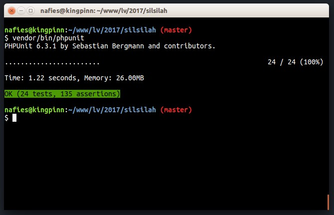

<h1 align="center">Aplikasi Silsilah Keluarga</h1>

<p align="center">
<a href="https://github.com/laravel/framework/actions"></a>
<a href="https://packagist.org/packages/laravel/framework"></a>
<a href="https://packagist.org/packages/laravel/framework"></a>
<a href="https://packagist.org/packages/laravel/framework"></a>
</p>

## About Family Three App

  Family Three App yang dikembangkan menggunakan framework Laravel, bertujuan untuk menyediakan sistem silsilah keluarga yang praktis dan efisien dalam pendataan anggota keluarga kita. Dengan menggunakan aplikasi ini, proses pengumpulan dan pengorganisasian informasi mengenai hubungan keluarga menjadi lebih mudah dan terstruktur. Aplikasi ini memungkinkan pengguna untuk dengan cepat menambahkan, mengedit, dan menghapus data anggota keluarga, serta melacak koneksi dan relasi antar anggota keluarga dengan mudah. Dengan fitur-fitur yang lengkap dan antarmuka yang intuitif, aplikasi ini membantu mempermudah tugas-tugas administratif terkait dengan pengelolaan keluarga, sehingga memungkinkan kita untuk fokus pada hubungan dan interaksi yang lebih bermakna dalam keluarga kita.
  
 <h2 id="fitur">Fitur apa saja yang tersedia di Family Three App?</h2>

- Pendaftaran Anggota Keluarga: Pengguna dapat mendaftarkan anggota keluarga baru dengan menyediakan informasi seperti nama, tanggal lahir, jenis kelamin, hubungan keluarga, dan foto profil.

- Pembuatan Silsilah: Aplikasi ini memungkinkan pengguna untuk membuat silsilah keluarga dengan menambahkan anggota keluarga, menghubungkan mereka berdasarkan hubungan keluarga, dan mengatur tingkatan generasi.

- Penyuntingan Data: Pengguna dapat mengedit informasi anggota keluarga yang sudah ada, termasuk perubahan data personal, pembaruan foto, atau mengubah hubungan keluarga.

- Pencarian dan Penyortiran: Fitur pencarian dan penyortiran memungkinkan pengguna untuk dengan mudah menemukan anggota keluarga berdasarkan nama, tanggal lahir, atau hubungan keluarga tertentu.

- Tampilan Silsilah Interaktif: Aplikasi ini menyediakan tampilan silsilah interaktif yang memudahkan pengguna dalam melihat dan memahami hubungan antar anggota keluarga secara visual.

- Catatan dan Riwayat: Pengguna dapat menambahkan catatan atau riwayat khusus untuk setiap anggota keluarga, seperti catatan medis, pencapaian penting, atau peristiwa spesial dalam hidup mereka.

- Manajemen Album Foto: Aplikasi ini dapat memiliki fitur manajemen album foto, di mana pengguna dapat mengunggah dan mengatur foto-foto keluarga, serta memberikan deskripsi dan keterangan pada setiap foto.

- Pembagian Akses: Aplikasi ini dapat memiliki sistem keamanan yang memungkinkan pengguna untuk membagi akses ke silsilah keluarga dengan anggota keluarga lainnya. Misalnya, orang tua dapat memberikan akses tertentu kepada anak-anak mereka.

- Notifikasi Pembaruan: Pengguna dapat menerima notifikasi atau pemberitahuan tentang pembaruan data anggota keluarga, seperti perubahan informasi atau penambahan anggota baru.

- Ekspor Data: Fitur ini memungkinkan pengguna untuk mengunduh data silsilah keluarga dalam format yang dapat diimpor ke aplikasi lain atau dicetak dalam bentuk laporan.

Fitur-fitur ini akan membantu mempermudah pendataan dan pengelolaan keluarga dalam aplikasi web silsilah keluarga berbasis Laravel. Tentu saja, fitur-fitur tersebut dapat disesuaikan dengan kebutuhan dan preferensi pengguna.

## Requirements
- [PHP >= 8.1.6](http://php.net/)
- [Laravel Framework](https://github.com/laravel/framework)

## Laravel Version Compatibility
_____________________
| Laravel | PHP     |

| 8.x.x   | 8.1.x   |
_____________________

<h2 id="download">💻 Install</h2>

1. Clone repository

```bash
    git clone https://github.com/IdhamIKN/family-tree.git
```

```bash
    cd TahfidzApp-Monitoring
```

```bash
    composer update
```

```bash
    copy .env.example .env
```
2. Konfigurasi database melalui `.env`

```bash
DB_PORT=3306
DB_DATABASE=xxxx
DB_USERNAME=root
DB_PASSWORD=
```
3. Migrasi dan symlinks

```bash
php artisan key:generate
```
```bash
php artisan migrate --seed
```
4. Jalankan website

```bash
php artisan serve
```

5. Tambahkan alamat email yang digunakan mendaftar pada file `.env`:
    ```bash
    SYSTEM_ADMIN_EMAILS=admin@email.com;other_admin@email.com
    ```
    
 ## Testing
Ingin mencoba automated testingnya? Silakan ketik perintah pada terminal: `vendor/bin/phpunit`

#### Automated Testing
```bash
$ vendor/bin/phpunit
```

### Konsep
1. Satu orang memiliki satu ayah (belum sebagai tentu orang tua)
2. Satu orang memiliki satu ibu (belum sebagai tentu orang tua)
3. satu orang memiliki satu orang tua
4. Satu orang memiliki 0 s/d beberapa anak
5. Satu orang bisa memiliki pasangan (Istri/Suami)
6. Satu pasangan bisa memiliki 0 s/d beberapa anak
7. Satu orang laki-laki bisa memiliki maksimal 4 pasangan yang tidak cerai (TODO)
8. Satu orang perempuan bisa memiliki maksimal 1 pasangan yang tidak cerai (TODO)
9. Satu orang perempuan yang suaminya meninggal otomatis set tanggal cerai (pada data pasangan) (TODO)

### Input ke sistem
1. Input Nama dan Jenis Kelamin
2. Tambah Ayah
3. Tambah Ibu
4. Tambah Pasangan
5. Tambah Anak

### Data Orang
1. Nama Panggilan
2. Jenis Kelamin
3. Nama Lengkap
4. Tanggal Lahir
5. Tanggal Meninggal (atau cukup tahun)
6. Alamat
7. Telp
8. Email

### Data Pasangan (TODO)
1. Suami
2. Istri
3. Tanggal menikah
4. Tanggal Cerai
5. Alamat




<h2 id="[dukungan](https://saweria.co/idhamIKN)">💌 [Support Me]</h2>

<p>
Kamu bisa mendukung aku di platform Trakteer! Dukungan kamu akan sangat berarti. Namun, dengan kamu memberikan <i>star</i> pada <i>project</i> ini juga sudah sangat cukup kok~!
</p>

<a href="https://saweria.co/idhamIKN" target="_blank"></a>

<h2 id="kontribusi">🤝 Contributing</h2>

<p>
<i>Contributions, issues and feature requests</i> sangat diapresiasi karena aplikasi ini jauh dari kata sempurna. Jangan ragu untuk melakukan <i>pull request</i> dan membuat perubahan pada <i>project</i> ini, yaaa!
</p>

<h2 id="lisensi">📝 License</h2>

<p>TahfidzApp is open-sourced software licensed under the MIT license.</p>

<h2 id="pembuat">🧍 Author</h2>

<p>TahfidzApp s dibuat oleh <a href="https://instagram.com/idhamikn?igshid=MmJiY2I4NDBkZg==">IdhamIKn</a> .</p>
